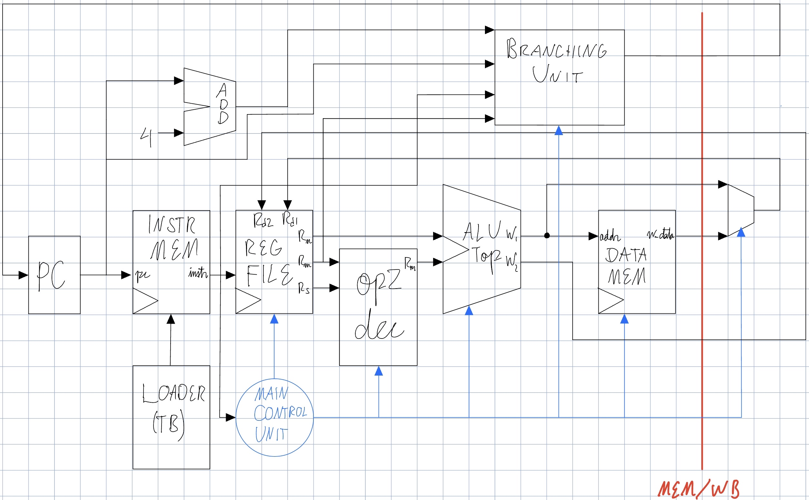

# ARMish Processor
This project seeks to explore a subset of the ARM instruction set, and create an ARM-inspired processor. The goal is to design a custom instruction set inspired by the ARM architecture, create an assembler for the instruction set, implement the architecture in hardware with an RTL model, and verify the correctness of the processor. This architecture is an educational project inspired by ARM-style RISC design using the ARM7TDMI-S data sheet as a reference. It is not ARM-compatible and does not use proprietary ARM encoding or IP. 

The assembler was implemented in Python, and the RTL model with verification testbenches were implemented using SystemVerilog.


# Instructions
1. In the assembler folder, run: ```python assembler.py file_name.s```. For example files, run ```python assembler.py .\asm_test_files\test_file.s```.
2. Move ```out.bin``` from the assembler folder to the same simulator location as ```proceesor/armish_processor/armish_processor.sim/top_sim.sv```.
3. Run simulation.

# Progress
- [x] ISA Design
- [x] Assembler
- [x] Instruction Memory
- [x] Program Counter Adder
- [x] Register FIle
- [x] Immediate Decoder
- [x] Shifter
- [x] op2dec
- [x] ALU + ALUTop
- [x] Main Control Unit
- [x] Data Memory
- [x] Branching Unit

# Performance

# Known Issues
- After a LDR instruction trying to read what was loaded will not use the correct value due to the lack of stalling hardware. For now, calling addx-al r0, r0, #0 or something similar after the ldr instruction will make it work.

# Future Work
- Pipelining with Hazard Control
- FPU
